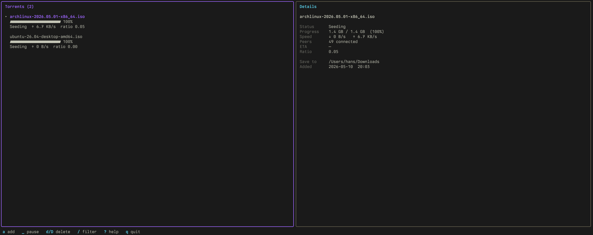

# lazytorrent

A lazygit-style terminal UI for torrents. Thin client over `transmission-daemon` — fast keyboard-driven actions on top of a daemon you already trust to do the heavy lifting (DHT, peers, disk, resume across reboots).



## Why

Existing torrent TUIs are either search-first (torrra), standalone full clients (superseedr, tortillas), or mature but in maintenance mode (stig). What was missing: a true lazygit clone — keyboard-first, panel-based, opinionated bindings — that wraps a real daemon you already run.

## Prerequisites

- Go 1.26+
- `transmission-daemon` installed and running

On macOS:

```sh
brew install transmission-cli
brew services start transmission-cli
```

On Linux:

```sh
# Debian / Ubuntu
sudo apt install transmission-daemon
systemctl --user start transmission-daemon

# Fedora
sudo dnf install transmission
```

By default lazytorrent talks to `http://127.0.0.1:9091/transmission/rpc` with no auth — this matches `transmission-daemon`'s out-of-the-box config.

## Install

### Homebrew (macOS / Linux)

```sh
brew install hansbala/tap/lazytorrent
```

### Arch Linux (AUR)

```sh
yay -S lazytorrent-bin       # or your preferred AUR helper
```

### Debian / Ubuntu

Download the latest `.deb` from the [releases page](https://github.com/hansbala/lazytorrent/releases):

```sh
curl -LO https://github.com/hansbala/lazytorrent/releases/latest/download/lazytorrent_<version>_linux_amd64.deb
sudo dpkg -i lazytorrent_*.deb
```

### Fedora / RHEL

```sh
curl -LO https://github.com/hansbala/lazytorrent/releases/latest/download/lazytorrent_<version>_linux_amd64.rpm
sudo rpm -i lazytorrent_*.rpm
```

### Pre-built tarballs

Darwin and Linux × amd64 + arm64 tarballs (no package manager) on the [releases page](https://github.com/hansbala/lazytorrent/releases).

### From source

```sh
git clone https://github.com/hansbala/lazytorrent.git
cd lazytorrent
go build -o lazytorrent .
./lazytorrent
```

## Usage

```sh
lazytorrent              # launch the TUI
lazytorrent --doctor     # check that prerequisites are in place
```

If the daemon isn't running, lazytorrent fails fast at startup with a one-line hint. Run `--doctor` for the full diagnostic and platform-appropriate fix commands.

### Keyboard shortcuts

Press `?` inside the TUI for the in-app cheat sheet.

**Navigation**

| Key | Action |
|-----|--------|
| `j` / `k` | down / up |
| `g` / `G` | top / bottom |
| `/` | filter by name |

**Torrent actions**

| Key | Action |
|-----|--------|
| `a` | add (magnet, URL, or local .torrent path; auto-pastes from clipboard) |
| `Space` | pause / resume |
| `d` | delete (keep files) |
| `D` | delete (remove files from disk) |
| `v` | verify local data |
| `R` | re-announce to trackers |
| `y` | copy magnet to clipboard |
| `o` | open save folder in OS file manager |

**Misc**

| Key | Action |
|-----|--------|
| `r` | refresh now |
| `?` | show keyboard help |
| `q` / `Ctrl-C` | quit |

### Adding torrents

The `a` modal accepts any of:

- A magnet URI (`magnet:?xt=urn:btih:…`) — most common
- An HTTP(S) URL pointing at a `.torrent` file (the daemon fetches it)
- A local path to a `.torrent` file (with `~` expansion)

Clipboard auto-paste triggers on magnet URIs and `.torrent` URLs only, so it doesn't hijack the field when you have an unrelated URL on the clipboard.

## Development

```sh
go test ./...      # run all tests
go build ./...     # compile everything
go run . --doctor  # quick sanity check
```

### Cutting a release

```sh
scripts/release.sh v0.2.0                       # prompts before pushing
scripts/release.sh v0.2.0 --dry-run             # show the plan, don't push
scripts/release.sh v0.2.0 -m "release summary"  # custom tag message
```

The script verifies a clean tree on `main`, runs tests, and pushes the annotated tag. The push triggers `.github/workflows/release.yml`, which runs goreleaser to build cross-platform tarballs and create the GitHub release.

Layout:

- `internal/transmission` — JSON-RPC client (session-id handshake + all RPC methods used)
- `internal/doctor` — startup precheck + `--doctor` diagnostics with platform-aware fix hints
- `internal/pathutil` — small shared helpers (tilde expansion)
- `internal/tui` — Bubble Tea app: model, update, view, modals, filter, help overlay
- `main.go` — flag parsing, precheck, TUI launch

## Limitations

- Local daemon only — no remote Transmission support yet
- No config file — RPC URL and save dir defaults are hardcoded to the daemon's
- macOS and Linux supported; Windows untested
- No mouse support — keyboard-first, by design

## License

MIT — see [LICENSE](LICENSE).
